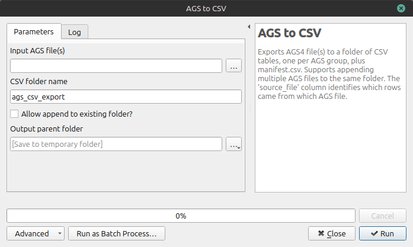

Use this when you need a direct AGS to CSV export quickly.

This route is useful when you need a quick data drop for early visualisation. It is fast, but because it bypasses database review, it should be treated as a draft-first route rather than a final issue route.

## Best use cases

- Early-stage data exploration.
- Rapid draft checks.
- Projects where no QGIS edits are needed.

## Step-by-step UI guidance

{width = "600"}
/// caption
AGS2CSV dialog
///

The following items are essential:

- '**Input AGS File(s)**' = AGS (.ags) filename.
- '**Output parent folder**' All the CSV files will be created in a single folder.

The following items are optional:

- '**Allow append to existing folder**' Use if multiple AGS projects are to be exported for analysis at the same time.

Click Run.

If you are producing multiple drafts in one day, use clear folder names that include issue stage and date. This makes handover and rollback much easier.

## Expected output

- One CSV per AGS group that exists in the source.
- manifest.csv (what exported and row counts).
- ags_column_metadata.csv (column/unit metadata).

!!! Important
    - Only existing source groups and columns are exported.
    - Placeholder tables are not created for missing groups.

==Screenshot Placeholder==

==[Insert screenshot: AGS to CSV dialog]==

==[Insert screenshot: Export folder showing CSV outputs and manifest.csv]==
