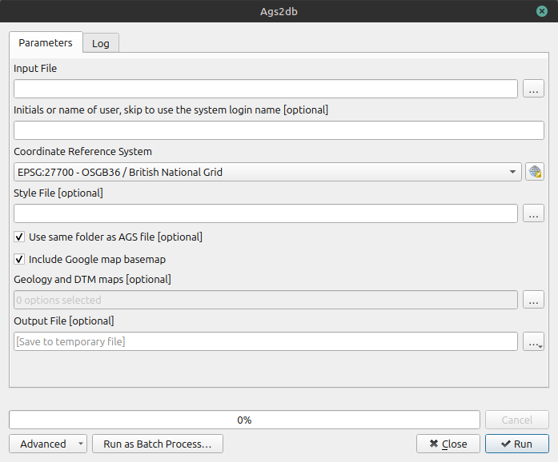

!!! tip
    AGS4 files must be validated before conversion. See ags tools validator [Insert a link]

AGS4 Files must be converted to GeoPackage files to be viewed on a map in QGIS. This can be done by using the ags-tools processing plugin.

Use AGS2DB to create a spatial, reviewable database before reporting.

This is usually the best first technical step in a geotechnical workflow because it gives you a map view and table view of the same dataset. In practice, this is where you catch location issues, ID mismatches, and obvious depth anomalies early.

In QGIS select the ags-tools processing plugin from the processing toolbox panel and select AGS2DB

!!! tip
    If you can't find the processing toolbox panel because it has been closed, search for 'AGS2DB' using the search box in the bottom left hand corner of the QGIS application.

The following form is displayed:

{ width="600"}
/// caption
AGS2DB data entry dialog
///

The following items are essential:

- '**Input File**'  = AGS (*.ags) filename
- '**Coordinate Reference System**' This will be filled in by default to the OSGB grid. This must not be changed.

The following items are optional:

- '**Output File**' If this isn't specified a file will be written to a 'temporary' location.
- '**Initials or name of of the user**'. This is used to record the metadata in the source table of the GeoPackage.
- '**Style file**'. This is used to set the symbology of the exploratory hole markers. If none is set a default file will be used. See [QGIS: docs - symbology](https://docs.qgis.org/3.44/en/docs/training_manual/basic_map/symbology.html)
- '**Use same Folder as AGS file**' If no Output file is specified the output will be written to the same folder as the input file.
- '**Include Google map basemap**'. If this is ticked a Google-sourced basemap will be added to the layers.
- '**Geology and DTM maps**'. Additional layers provided mostly by the BGS (e.g. BGS Bedrock) can be added to the map. Select from the list. The order of the layers is automated, as is the transparency. These can be changed after creation.

Selecting 'Run' will process the AGS file, create and load a GeoPackage file into QGIS add chosen layers and apply a symbology to the exploratory hole markers.

## What you should see after run

- A new GeoPackage file in your output folder.
- AGS tables loaded as layers/tables.
- Borehole point layer (for example LOCA) where coordinates exist.
- source_file field present for data lineage.

## GeoPackage description

A GeoPackage is a database file. The format is set by the OGC(include link)
The AGS conversion process creates a table LOCA that includes the geometry of exploratory holes.
All the other groups in the AGS file are converted into tables in the GeoPackage.
Additionally the AGS UNIT and TYPE heading rows are included as a single table 'UNTY'.
Two other tables area also created: 'source' and 'version_control'. These tables are included to enable a user to understand the source of the data and manage any changes to the GeoPackage, such as the addition of geology codes (GEOL_GEOL).

## Geotechnical QA checks to perform immediately

1. LOCA map check: exploratory holes appear in correct site area.
3. ID check: LOCA_ID labels are accurate.

## Common mistakes to avoid

- Running with the wrong AGS file revision.
- Saving output into the raw input folder.
- Skipping map checks

When the database checks are complete the data can be used for analysis, either within QGIS or exported to CSV for use in PowerBI or spreadsheets.

- Use AGS2CSV for fast direct export.
- Use DB2CSV for controlled export after review.
- In QGIS tools such a Attribute tables, DataPlotly and OpenLog can be used to review change and analyse the data.

==Screenshot Placeholder==

==[Insert screenshot: AGS to Database tool dialog with fields highlighted]==

==[Insert screenshot: LOCA layer displayed on map]==

==[Insert screenshot: GEOL table in attribute table view]==

