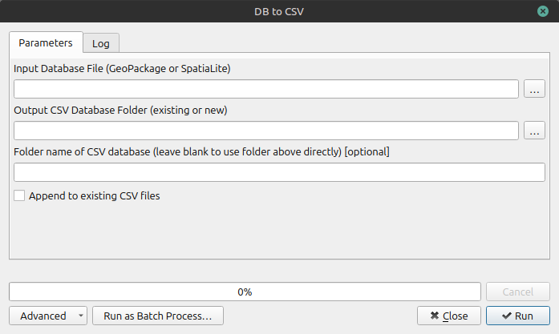

DB2CSV provides the ability to create a suite of CSV files from a GeoPackage database. This is useful if the data in the AGS file has been changed in QGIS, for example if Geology Codes have been added and the user wants to analyse the data in an application that uses CSV for data input, such as spreadsheets or a business analytics platform such as PowerBI or Tableau. This is also useful if multiple AGS file data sets need to be analysed together.

This is the recommended export route. It gives the user confidence that the CSV output reflects reviewed data and not just raw incoming AGS content.

## Why this route is often preferred

- You are exporting from reviewed data.
- It supports better QA and audit traceability.
- It is usually the safer route for formal issue.

Open Processing Toolbox.
click on DB2CSV.

{width = "600"}
/// caption
ags-tools: DB2CSV dialog
///

The following items are essential:

- '**Input Database File**'  = GeoPackage (.gpkg) filename.
- '**Output CSV Database Folder**' All the CSV files will be created in a single folder.

The following items are optional:

- '**Folder name of CSV database**' This is a file name of the zipped CSVs
- '**Append to existing CSV files**' Use if multiple AGS projects are to be exported for analysis at the same time.

Click 'Run'

## Expected output

- One CSV per AGS group that exists in the source.
- manifest.csv (what exported and row counts).
- ags_column_metadata.csv (column/unit metadata).

!!! Important
    - Only existing source groups and columns are exported.
    - Placeholder tables are not created for missing groups.

==[Insert screenshot: Database to CSV dialog]==

==[Insert screenshot: CSV output folder for final issue]==

