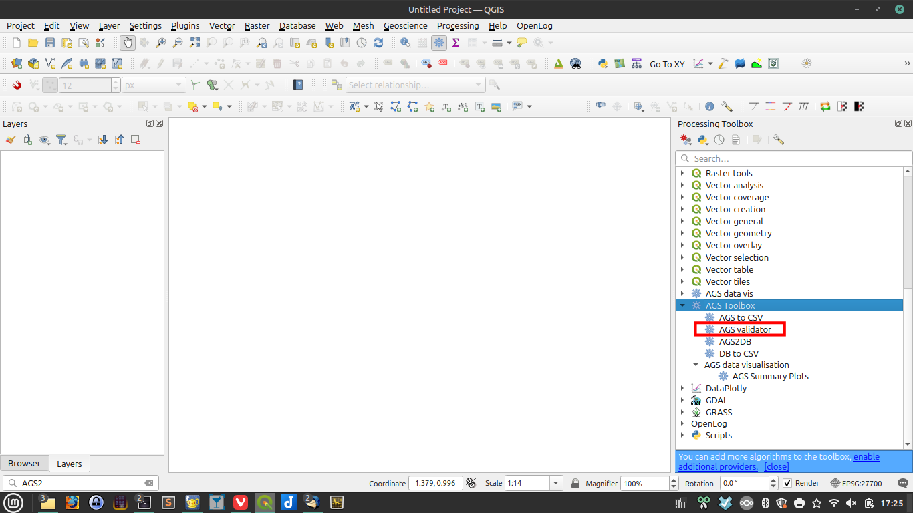
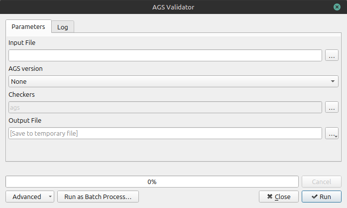

An AGS file can be validated from within QGIS, using the ags-tools plugin.

!!! tip
    If the ags-tools validator fails for any reason, other validators are available including the one hosted by the BGS [here](https://agsapi.bgs.ac.uk).

!!! tip
    If you can't find the processing toolbox panel because it has been closed, search for 'AGS validator' using the search box in the bottom left hand corner of the QGIS application.

{ width="600" }
/// caption
Launch AGS4 validator
///

{ width="600" }
/// caption
ags-tools: AGS4 validator dialog
///

The following items are essential:

- '**Input File**'  = AGS filename [input]
- '**Coordinate Reference System**' This will be filled in by default to the OSGB grid. This must not be changed.
- '**Checkers**'Normally the default 'ags' should be selected.

The following items are optional:

- '**Output File**'
