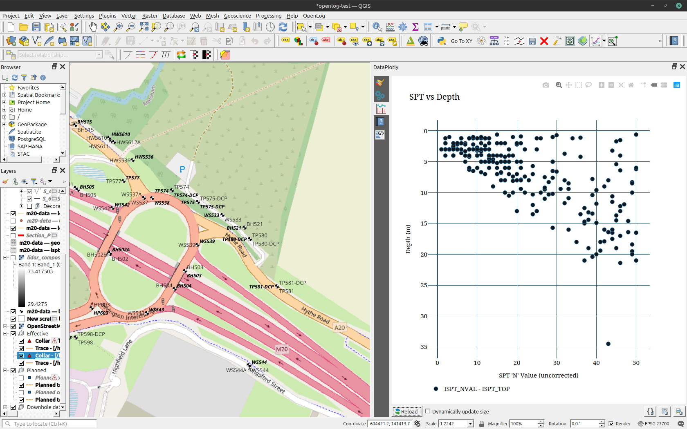

==TD This process needs to be tested by someone new to it.==

DataPlotly is a freely available QGIS plugin that enables the user to view simple charts such as SPT vs Depth.
It is extremely useful for quickly viewing filtered, exploratory hole test data. It can be used, with the QGIS Layout functionality to produce report-quality output.

An example plot of SPT vs Depth is shown below

DataPlotly is very simple to use and has good guidance [here](https://dataplotly-docs.readthedocs.io/en/latest/index.html)

It can create the following, common plot types:

- [Scatter](https://dataplotly-docs.readthedocs.io/en/latest/scatter.html)
- [Histogram](https://dataplotly-docs.readthedocs.io/en/latest/histogram.html#histogram)
- [Bar](https://dataplotly-docs.readthedocs.io/en/latest/bar.html#bar-plot)
- [Box](https://dataplotly-docs.readthedocs.io/en/latest/box.html#box-plot)
- [Ternary](https://dataplotly-docs.readthedocs.io/en/latest/ternary.html#ternary-plot)
- [Pie](https://dataplotly-docs.readthedocs.io/en/latest/pie.html#pie-plot)

!!! tip
    In order to be able to use the '[Use only selected features](https://dataplotly-docs.readthedocs.io/en/latest/basic_usage.html#use-only-selected-features)' functionality when tables other than LOCA are being used from the GeoPackage data source, 'relations' must be created between LOCA and the data table and the 'SelectbyRelationship' plugin must be selected. Guidance on how to do this is explained here. ==ins link==

!!! warning
    Avoid using multiple plots if the Y axis is inverted (i.e. plot vs depth). There is a [known bug](https://github.com/ghtmtt/DataPlotly/issues/388) whereby the layout is not honoured

