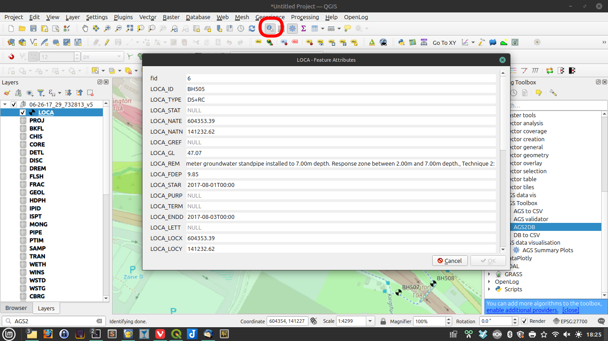
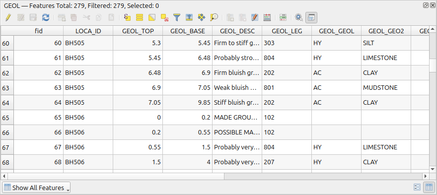
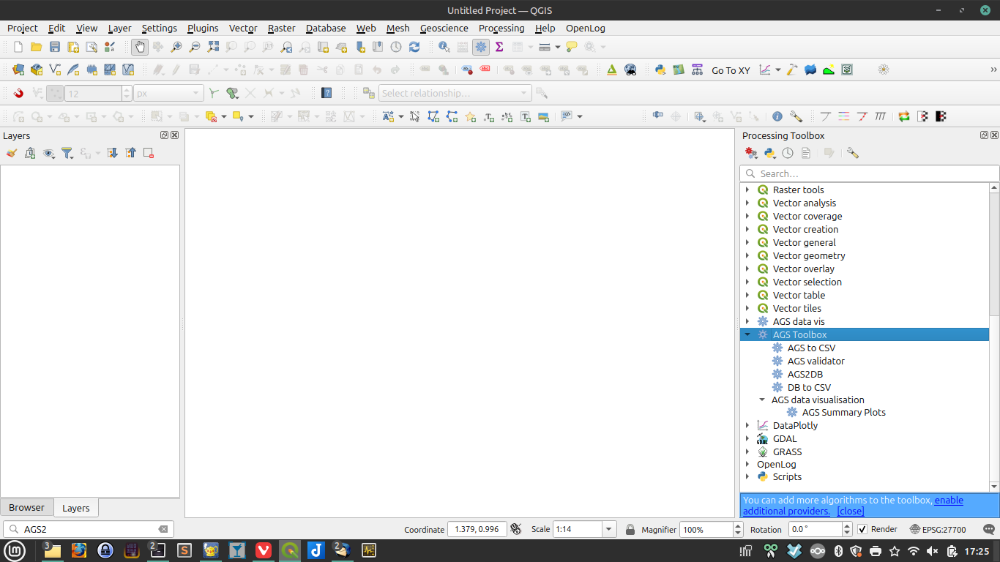

This guide introduces QGIS from the perspective of a geotechnical engineer or engineering consultant who wants to view, organise, and review AGS-related spatial data without coding.

{width = "400"}

## What is QGIS?

QGIS is a free GIS application used to:
- load map data
- view borehole and site locations
- style layers visually
- inspect attribute data in tables
- export data for use elsewhere
- run plugins and processing tools

For geotechnical work, QGIS is useful because it lets you connect location-based information to borehole, geology, sampling, and test data.

## Key QGIS Concepts

### Project

A QGIS project is your working file. It stores:
- which layers are loaded
- how they are styled
- map extent and layout
- links to source data

It does not usually duplicate the original data; it points to it.

### Layer

A layer is a dataset shown in QGIS.

Examples:
- borehole point locations
- site boundary polygons
- geology layers
- CSV tables joined to mapped data
- aerial imagery or basemaps

!!! tip
    Think of layers as transparent sheets stacked on top of each other.

Features on active layers can be identified by selecting 'identify feature' then clicking on an item on the map.

{width = "600"}
/// caption
Select 'Identify Features' (circled red) after ensuring the required layer is active.
///

### Attribute Table

Each layer can have an attribute table. This is where the non-map data sits.

{width = "600"}
/// caption
Example attribute table (GEOL)
///

For boreholes, the attribute table may include:
- borehole ID
- coordinates
- ground level
- depth
- project reference
- geology summary

In practice, the map shows where something is and the attribute table shows what it is.
Attributes can be created and edited.

### Symbology

Symbology controls how layers look.

You can change:
- point colour
- symbol shape
- label text
- line style
- fill colour

This helps engineers quickly distinguish between:
- borehole types
- sample types
- geology classes
- investigation status

### Coordinate Reference System

The coordinate reference system, or CRS, tells QGIS how coordinates are interpreted.

For UK geotechnical work, this is often:
- British National Grid: `EPSG:27700`

Some outputs or web maps may use:
- WGS84: `EPSG:4326`

!!! tip
    If coordinates appear in the wrong place, CRS is one of the first things to check.

## Main Areas of the QGIS Screen

### Layers Panel

Usually shown on the left. This lists all loaded layers.

You can:
- turn layers on and off
- reorder layers
- group layers
- rename layers for clarity

### Map Canvas

This is the main map window. It shows the spatial view of your data.

You can:
- zoom in and out
- pan around site locations
- click features to inspect them

### Browser Panel

Used to browse files, folders, GeoPackages, and database connections.

This is helpful when opening:
- GeoPackages created from AGS files
- folders of CSV outputs
- project files

### Processing Toolbox

This is where many plugins and automation tools appear.

In this repo, the AGS tools are accessed from the Processing Toolbox.

Typical use:
- open Processing Toolbox
- search for a tool by name
- run the tool through a dialog box

{width = "600"}
/// caption
Processing Toolbox is on the right hand side of the screen
///

## Typical QGIS Tasks for a Geotechnical User

### Load a spatial dataset

You might load:
- a GeoPackage containing borehole locations
- a site boundary shapefile
- an aerial image
- a terrain layer

### Inspect borehole records

You can:
- click a borehole on the map
- open its attribute table
- filter records by location or ID

### Style boreholes by type or status

You might colour points by:
- exploratory hole type
- status
- geology category
- cluster or project zone

### Join tabular data

QGIS can connect map layers to related tables using IDs such as:
- `LOCA_ID`
- sample IDs
- project IDs

This is useful when combining mapped boreholes with exported AGS tables.

### Export data

You can export selected layers or tables for use in:
- Power BI
- Excel
- other GIS software

## How Plugins fit In

==Need a section on the plugin manager==

QGIS plugins add extra tools to the base software.

For AGS and geotechnical workflows, plugins can help with:
- AGS conversion
- data export
- charting
- borehole log display
- geoscience interpretation

Some plugins are built into your organisation's workflow. Others are external community plugins.

## Good Habits for Non-Coder Users

- Keep raw AGS files unchanged and work from copies.
- Name output folders clearly by site or batch.
- Save QGIS projects regularly.
- Check layer CRS when data looks misaligned.
- Open attribute tables to confirm values before exporting.
- Keep a simple folder structure for raw data, GIS outputs, and reporting outputs.

## Suggested Learning Path

1. Learn how to open a QGIS project and turn layers on and off.
2. Learn how to open an attribute table and filter rows.
3. Learn how to use the Processing Toolbox.
4. Learn which AGS-related plugins support your workflow.

